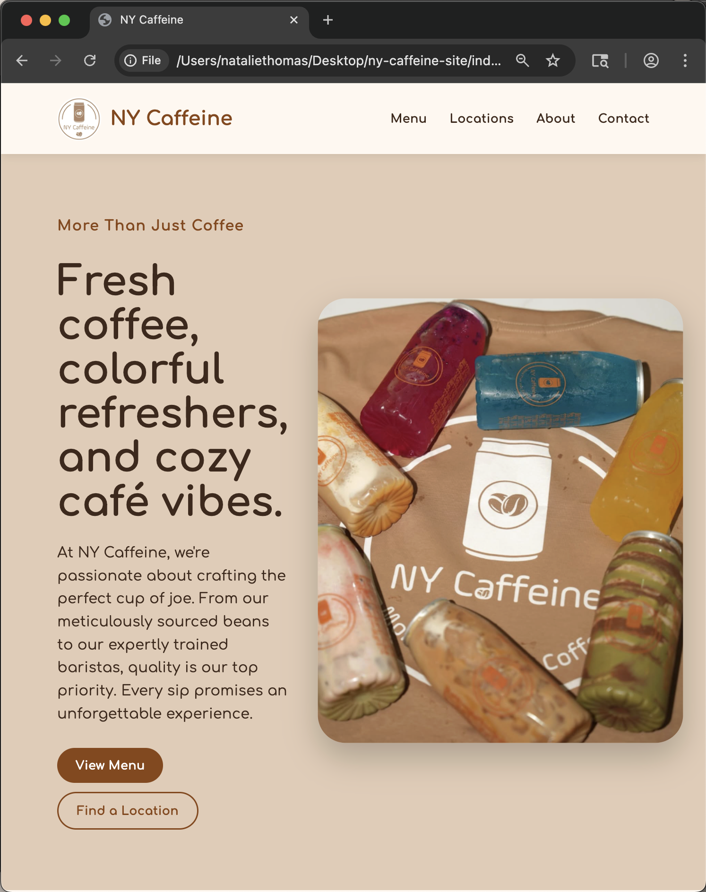
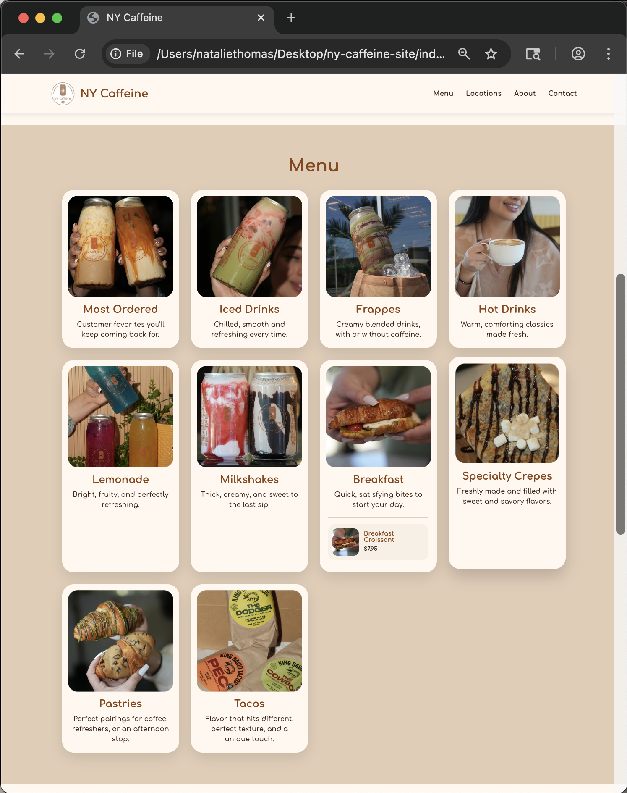

# NY Caffeine Website Prototype
Live Demo: https://ny-caffeine-website-prototype.vercel.app
GitHub: https://github.com/nataliethomas04/ny-caffeine-website-prototype

## Preview

NY Caffeine is a multi-location small business with a location nearby my house and I noticed they don't have a website.

The goal of this project was to design a easy to use, mobile-friendly website where customers can view their menu, find locations, etc. to further the cafè's growth.

# Features 
-responsive landing page
-interactive menu (click-to-open)
-product images, prices and descriptions
-location links to google maps
-instagram button
-hover animations and UI effects
-inspired by their exisiting cafè aesthetic

# Security 
This project was also reviewed from a basic web security perspective. 

-HTTPS ready deplyoment
-safe external links (target="_blank")
-static frontend
-no customer data collection
-no login
-no payment handling
-ready for future contact and online ordering 

# Tech Used
-HTML
-CSS
-JS
-Git
-Github

# Future Improvemnts
-fully developed and realistic menu data
-online ordering feature
-add secure contact form
-deploy with https
-more ARIA labels and alt text